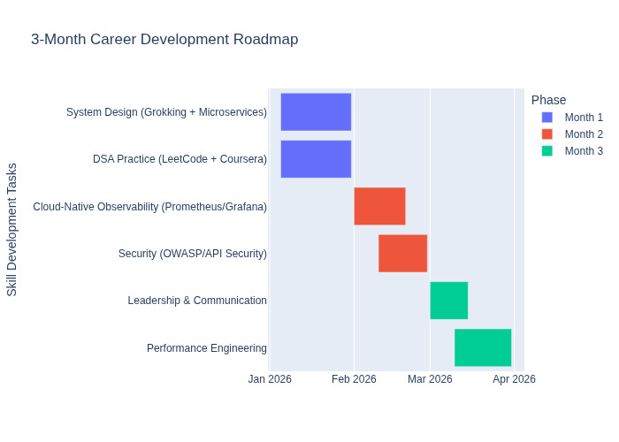

# Senior Developer Roadmap 🚀


## 📌 Overview
This repository documents my 3-month roadmap to become a Senior Developer, including:
- System Design
- Data Structures & Algorithms
- Cloud-Native Observability
- Security Best Practices
- Leadership & Performance Engineering

## 🗂 Repository Structure
```
senior-dev-roadmap/
│── system-design-examples/
│── leetcode-solutions/
│── cloud-observability/
│── security/
│── performance/
│── docs/
```

## ✅ Roadmap


## 🔍 Milestones
- **Month 1:** System Design + 50 LeetCode problems
- **Month 2:** Cloud Observability + API Security
- **Month 3:** Leadership + Performance Engineering

## 📊 Progress


## 🛠 How to Use
1. Clone the repo
2. Navigate to the milestone folder
3. Follow instructions in each README

## 📚 Resources
See [Resources.md](Resources.md) for free and paid learning materials.
